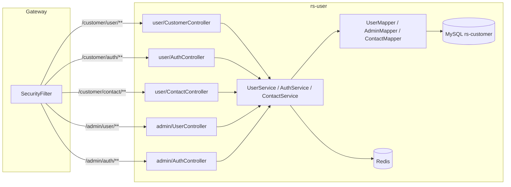
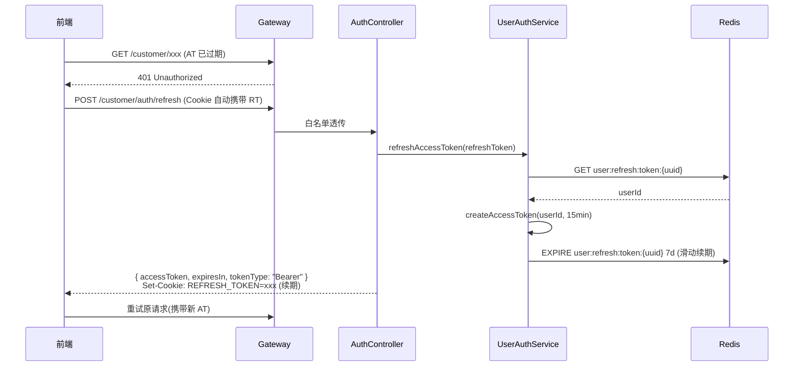
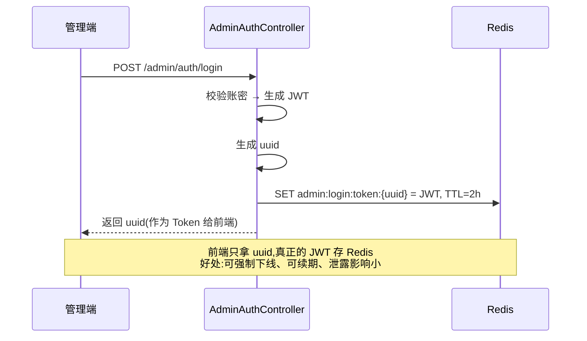
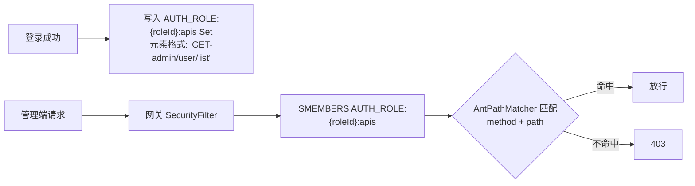

# 用户服务 rs-user

> 负责认证体系(用户端 + 管理端)、乘车人档案、RBAC 权限模型。是整套系统的"身份源"。

- **服务名**:`user-service`
- **端口**:`18081`
- **源码路径**:[`RailwaySystem-Backend/rs-service/rs-user`](../../RailwaySystem-Backend/rs-service/rs-user)

## 1. 服务职责与边界

| 对外能力 | 说明 |
|---------|------|
| 用户注册/登录 | 手机号/用户名/邮箱 + 密码,颁发 **Access Token(JWT) + Refresh Token(UUID)** |
| Token 刷新 | `/customer/auth/refresh`,以 HttpOnly Cookie 携带的 RT 换取新 AT(滑动续期) |
| 管理员登录 | 独立的管理端入口,基于 uuid+Redis 存 Token(有状态 Session) |
| 认证中心 | 供网关解析 Token,供其它服务查询用户资料 |
| 乘车人管理 | 一个用户可绑定多位乘车人(`contact` 表) |
| RBAC 权限 | 管理端的角色、权限、菜单 |
| 个人信息 | 头像、昵称、证件号、手机号 |

**边界约定**:

- 不做订单、积分、票务业务,其它服务通过 Feign 查用户 → 本服务只提供"查询能力",不暴露写接口
- 管理端 `/admin/user` 只给有权限的管理员
- Access Token(JWT)本身不落 Redis,由网关纯无状态校验签名 + 过期时间
- Refresh Token(UUID)落 Redis(`user:refresh:token:{uuid}` → userId,TTL 7 天),用于刷新 AT、登出踢人
- 管理员 Session 也落 Redis(`admin:login:token:{uuid}` → JWT,TTL 2 小时),用于强制下线

## 2. 架构图



## 3. 核心业务流程

### 用户登录(Access Token + Refresh Token 双 Token)

设计目标:**AT 无状态保证网关侧高性能**,**RT 有状态保证可登出/可踢人**,并让 AT 尽可能短命以降低泄露风险。

```mermaid
sequenceDiagram
    participant FE as 前端
    participant GW as Gateway(白名单放行)
    participant A as AuthController
    participant S as UserAuthService
    participant DB as MySQL
    participant R as Redis

    FE->>GW: POST /customer/auth/login/username {username, password, captcha}
    GW->>A: 透传(白名单)
    A->>S: userLoginByUserName()
    S->>DB: SELECT user WHERE username=?
    S->>S: BCrypt.matches(password)
    S->>S: JWTUtil.createAccessToken(userId, 15min)
    S->>S: UUID.randomUUID() → refreshToken
    S->>R: SET user:refresh:token:{uuid} = userId, TTL=7d
    A-->>FE: Body: { accessToken, expiresIn=900, userInfo }<br/>Set-Cookie: REFRESH_TOKEN=xxx; HttpOnly; SameSite=Lax
    Note over FE,R: 业务请求携带 Authorization: Bearer {AT}<br/>RT 由浏览器随同域请求自动携带,JS 读不到
```

### Access Token 过期 & 刷新



### 用户登出(撤销 RT)

```mermaid
sequenceDiagram
    participant FE
    participant A as AuthController
    participant R as Redis
    FE->>A: POST /customer/auth/logout (携带 RT Cookie)
    A->>R: DEL user:refresh:token:{uuid}
    A-->>FE: Set-Cookie: REFRESH_TOKEN=; Max-Age=0
    Note over FE,R: 已发出的 AT 在剩余 TTL 内仍可用(< 15min),<br/>这是无状态 AT 的固有代价;可接受。
```

### 管理员登录(Redis Session)

管理员不用纯 JWT,而是走 uuid + Redis:



### RBAC 权限下放

管理员角色的权限在登录时就写入 Redis,网关直接查 Redis 做权限校验,**避免每次请求都访问数据库**:



## 4. 核心代码解说

**JWT 工具**(`rs-common/util/JWTUtil`):

- 生成与解析分离:服务端(rs-user)生成,网关(rs-gateway)只负责解析校验
- Claims 中带 `tokenType=access` 标识,网关侧通过 `JWTUtil.isAccessToken(claims)` 拒绝非 AT 类型的 Token
- 密钥通过 Nacos 下发,启动时 `JWTUtil.initialize(jwtKey)` 注入

**双 Token 的签发**(`UserAuthServiceImpl#userLoginByUserName`):

```60:73:RailwaySystem-Backend/rs-service/rs-user/src/main/java/com/rs/service/impl/UserAuthServiceImpl.java
        String accessToken = JWTUtil.createAccessToken(user.getId(), RedisUserKeyConstant.USER_ACCESS_TOKEN_TTL);
        String refreshToken = UUID.randomUUID().toString();
        stringRedisTemplate.opsForValue().set(
                RedisUserKeyConstant.USER_REFRESH_TOKEN + refreshToken,
                String.valueOf(user.getId()),
                RedisUserKeyConstant.USER_REFRESH_TOKEN_TTL,
                TimeUnit.MILLISECONDS
        );
```

- AT TTL:**15 分钟**(`USER_ACCESS_TOKEN_TTL = 900000ms`)
- RT TTL:**7 天**(`USER_REFRESH_TOKEN_TTL = 604800000ms`)
- RT 用 UUID 而非 JWT——**不可自验证、必须回源 Redis**,这是它"可撤销"的前提

**RT 通过 HttpOnly Cookie 下发**(`AuthController#writeRefreshTokenCookie`):

```103:114:RailwaySystem-Backend/rs-service/rs-user/src/main/java/com/rs/controller/user/AuthController.java
    private void writeRefreshTokenCookie(HttpServletResponse response, String refreshToken, long maxAgeSeconds) {
        if (refreshToken == null || refreshToken.isBlank()) {
            return;
        }
        ResponseCookie cookie = ResponseCookie.from(REFRESH_TOKEN_COOKIE, refreshToken)
                .httpOnly(true)
                .secure(authProperties.isRefreshCookieSecure())
                .path("/")
                .sameSite("Lax")
                .maxAge(maxAgeSeconds)
                .build();
```

- `HttpOnly`:JS 读不到,规避 XSS 盗取
- `SameSite=Lax`:规避大部分 CSRF,同时不影响顶层导航
- `Secure` 由配置开关控制(本地 HTTP 关闭、生产 HTTPS 打开)

**SecurityFilter 的用户端分支**(位于 `rs-gateway`,服务于用户服务):

```118:124:RailwaySystem-Backend/rs-gateway/src/main/java/com/rs/filters/SecurityFilter.java
    private Mono<Void> checkPermission(Admin admin, ServerWebExchange exchange, WebFilterChain chain) {
        if (Objects.equals(admin.getRole(), 104)) {
            return chain.filter(exchange);
        }
        String key = AUTH_ROLE + admin.getRole() + ":apis";
        Set<String> members = stringRedisTemplate.opsForSet().members(key);
```

- `104` 是超级管理员角色,跳过权限校验
- 其它角色从 Redis Set 里取可访问的 `METHOD-path` 列表做匹配

**乘车人(contact)建模要点**:

- 一个用户可绑定多个乘车人,下单时从 `contact` 表选择
- `contact.id` 在订单里作为 `order_seat.passenger_id` 记录乘车人
- 支持身份证、护照、港澳通行证三种证件类型

## 5. 技术难点 & 踩坑记录

**坑 1:为什么用 AT+RT 双 Token,而不是单一长命 JWT?**

- 单一长命 JWT:一旦泄露,有效期内无法撤销,风险极大
- AT+RT 组合:AT 短命(15min)→ 即使泄露窗口也有限;RT 有状态(可 `DEL` 撤销)→ 登出/踢人靠它兜底
- 两者放置位置也刻意区分:AT 在 Header(`Authorization: Bearer`),用于业务请求;RT 在 HttpOnly Cookie,只在刷新/登出端点使用 → **最小权限暴露**

**坑 2:RT 为什么用 UUID 而不是 JWT?**

RT 的核心诉求是"可撤销"。JWT 是自验证的、离线可用,反而破坏了撤销能力。用 UUID + Redis 反查,语义最直白:**Redis 里没这条 key,RT 就失效**。

**坑 3:AT 放 Header vs RT 放 Cookie,为什么要拆?**

- AT 放 Header:适配多端(Web/App/小程序),网关无状态解析,CSRF 天然无风险
- RT 放 HttpOnly Cookie:JS 读不到,极大降低 XSS 导致的长期凭据泄露风险
- 如果 AT 也放 Cookie,会引入 CSRF 问题,还得额外加 CSRF Token;拆开是最稳的组合

**坑 4:登出后已签发的 AT 仍可用 15 分钟,可接受吗?**

可接受。这是无状态 AT 的固有代价,用 AT 短 TTL 将风险窗口压到最小。如业务对"立即失效"有强诉求,可补一个 `user:blacklist:jti` Redis 黑名单,网关侧校验 `jti` 是否在黑名单——**以牺牲一部分无状态性换取强一致性**,项目暂未上这层。

**坑 5:管理员为什么不用 AT+RT,而用 uuid+Redis?**

管理端对"强制下线、权限热更新"要求更强,直接让**整个 Token 都落 Redis**(前端拿到的只是 uuid 句柄),关 key 即时失效,也方便与 RBAC 权限 Set 同生命周期管理。C 端用户量大,不适合为每个请求都查一次 Redis,才采用无状态 AT 方案。

**坑 3:RBAC 的权限字符串格式**

Redis 里存的是 `GET-admin:user:list`,中间用 `-` 分隔 Method 和 path,path 里的 `:` 是为了避开 Redis key 里的 `/` 符号。在 `SecurityFilter` 读取时要还原成 `/admin/user/list` 再做 AntPathMatcher 匹配。这个设计不优雅,但历史包袱;如果重构可以换成 `GET:/admin/user/list` 格式。

**坑 4:跨服务查用户信息**

其它服务通过 Feign 调用 [`rs-api/client/user/UserClient`](../../RailwaySystem-Backend/rs-api/src/main/java/com/rs/client/user/UserClient.java) 查用户/乘车人。**千万不要直连 `rs-customer` 库**——这是微服务最大的反模式之一。

## 📚 相关文档

- [数据库设计](数据库设计.md)
- [专题 02:网关鉴权实战](../07-亮点技术专题/02-网关鉴权实战.md)
- [架构总览](../00-项目概述/架构总览.md)
