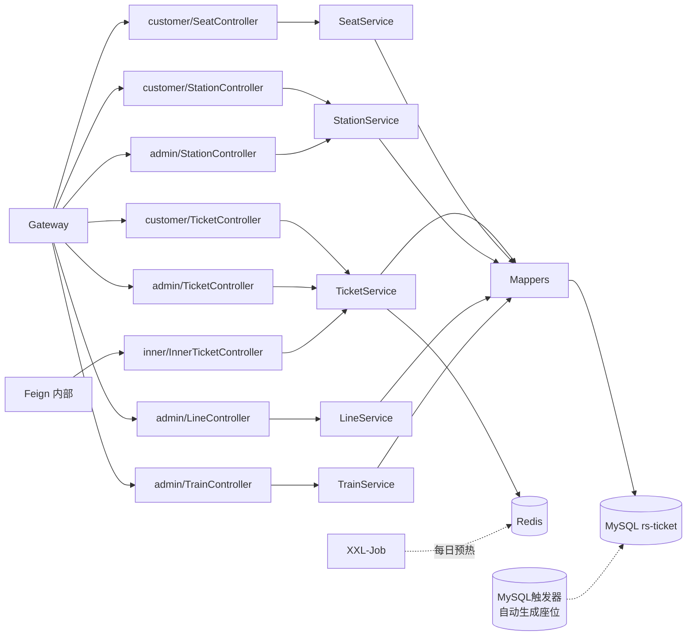
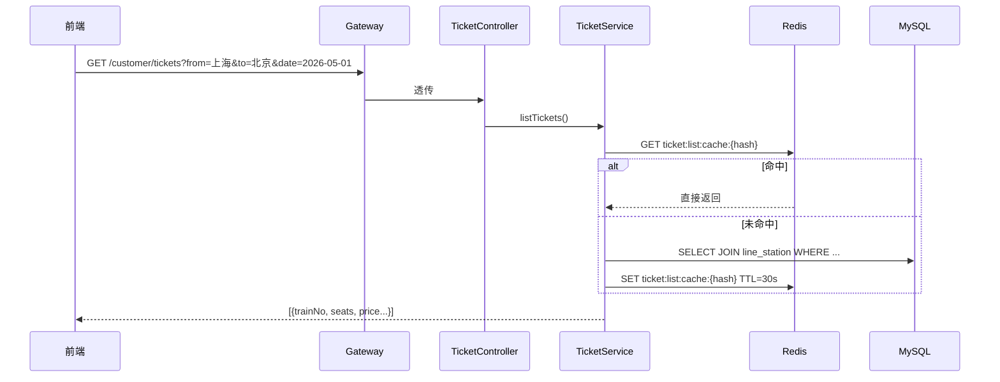
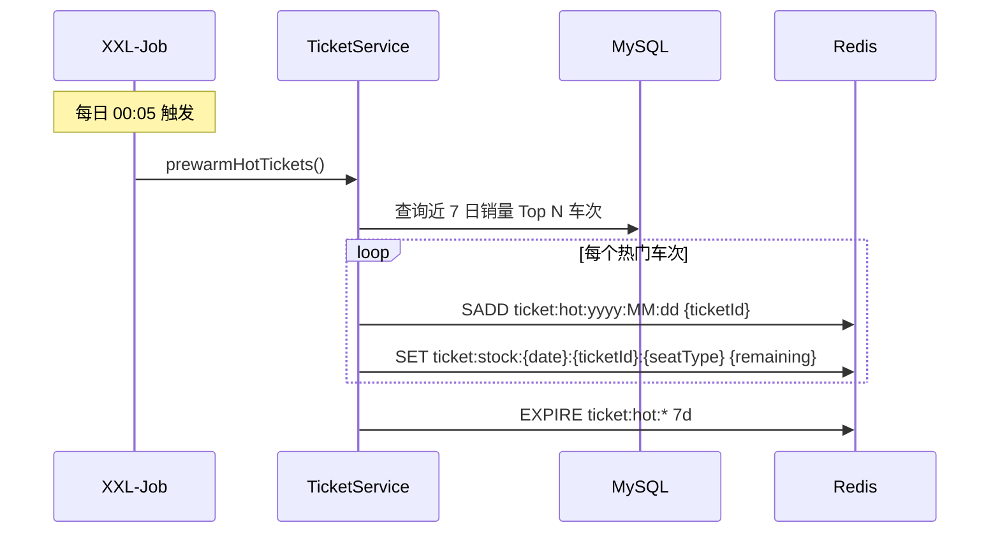
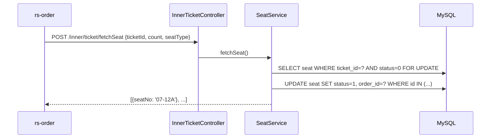

# 车票服务 rs-ticket

> 铁路业务的"数据底座":管车站、线路、车次、余票、座位库存。所有下单、查询、客服回答最终都要落到这里。

- **服务名**:`ticket-service`
- **端口**:`18082`
- **源码路径**:[`RailwaySystem-Backend/rs-service/rs-ticket`](../../RailwaySystem-Backend/rs-service/rs-ticket)

## 1. 服务职责与边界

| 对外能力 | 说明 |
|---------|------|
| 车站管理 | 增删改查、搜索(支持拼音联想) |
| 线路管理 | 一条线路 N 个途经站,带顺序 |
| 车次管理 | 车次绑定线路、出发到达时间、座位类型 |
| 余票查询 | 按**线路起止站 + 日期**查询(当前版本暂不支持中途站上下车) |
| 座位库存 | 一等座/二等座按**日期 + 车次**粒度维护 |
| 座位分配 | 下单时给具体座位号(如 07车12A) |
| 热点标记 | 每日热门车次进 Redis Set |

**边界**:

- 本服务不做订单、不做支付——只保证"票"的状态正确
- 对订单服务暴露 `/inner/ticket/**` 内部接口(预占、回滚、查座位)
- 余票数据既有 MySQL 持久化,也有 Redis 缓存,以 Redis 为秒杀场景的权威源

## 2. 架构图

## 3. 核心业务流程

### 余票查询(普通场景)

### 热门车次预热(XXL-Job 定时)

### 内部接口:订单服务预占座位

## 4. 核心代码解说

**座位自动生成**:项目用 MySQL 触发器,在车次(`train`)新增时自动生成对应的所有座位(比如 16 节车厢 × 80 座 = 1280 行)。好处:前端录入车次后,管理员不用手动拉座位表。

**余票的双写一致性**:

- MySQL 是事实源(`seat.status` 字段)
- Redis 维护"余量计数"用于秒杀场景
- 每次下单成功后,通过 RabbitMQ 消费者同步更新
- 如果二者不一致,以 MySQL 重建 Redis(有修复任务)

**Redis Key 命名**:

| Key | 用途 |
|-----|------|
| `ticket:hot:yyyy:MM:dd` | Set,存当日热门车次 ID |
| `ticket:stock:{date}:{ticketId}:{seatType}` | String,余量 |
| `ticket:list:cache:{queryHash}` | String,查询结果缓存 |
| `ticket:order:info:{orderId}` | String,订单快照(TCC 中转) |

## 5. 技术难点 & 踩坑记录

**坑 1:区间票(中途站上下车)当前未实现——只卖"整段票"**

真实的铁路票最大特色是"一票多段":北京→上海的 G1 次,如果你买北京→南京,那么南京→上海那段的座位仍然可售。要实现需要:
- 座位库存从"按日期+车次"升级为"按日期+车次+**区段**"
- 查询时根据用户 OD 站号 vs 线路途经站顺序,聚合"所选区段上每一跳"的可售数量求最小值
- 下单时把选中的座位在对应区段置位,仅释放非所选区段

**本项目当前版本的简化**:`ticket` 表直接绑定"线路起点→线路终点"的完整 OD,`searchTicket` 里的 `originStationId`/`destinationStationId` 是**与线路起止站严格相等的过滤条件**,查询中途站会返回空。经停站信息(`stop_stations` 表)仅用于车次详情展示,不参与售票。

是否支持区间票已列入 [ROADMAP](../ROADMAP.md) 中期规划,涉及库存模型与订单模型的联动改造。

**坑 2:Redis 缓存什么时候失效?**

- 查询列表:TTL 30 秒(近实时即可)
- 车次详情:TTL 5 分钟
- 热点标记:TTL 到次日凌晨(由 XXL-Job 每日重置)
- 余量:不设 TTL,只靠下单/退票时增减

**坑 3:座位号怎么分配?**

朴素实现:`SELECT ... FOR UPDATE LIMIT N`,数据库行锁串行化,高并发下是瓶颈。本项目热门场景走 Redis Lua 先扣量,再异步分配座位号;非热门场景直接 FOR UPDATE——在"一致性优先"和"性能优先"之间找平衡。

**坑 4:跨日车次的时间冲突检测**

一个乘车人不能同时买两张时间重叠的票。我们用 Redis Bitmap 做判定:每个用户每日有一个 1440 位的 Bitmap(每分钟一位),下单时用 [`CheckAndSetRepeatTimeBitmap.lua`](../../RailwaySystem-Backend/rs-service/rs-order/src/main/resources/lua/CheckAndSetRepeatTimeBitmap.lua) 原子检查并置位。跨日车次另有 [`CheckAndSetRepeatTimeCrossDay.lua`](../../RailwaySystem-Backend/rs-service/rs-order/src/main/resources/lua/CheckAndSetRepeatTimeCrossDay.lua) 处理两天的 Bitmap。

## 📚 相关文档

- [数据库设计](数据库设计.md)
- [专题 01:秒杀一致性](../07-亮点技术专题/01-秒杀一致性.md)
- [订单服务 README](../03-订单服务/README.md)
