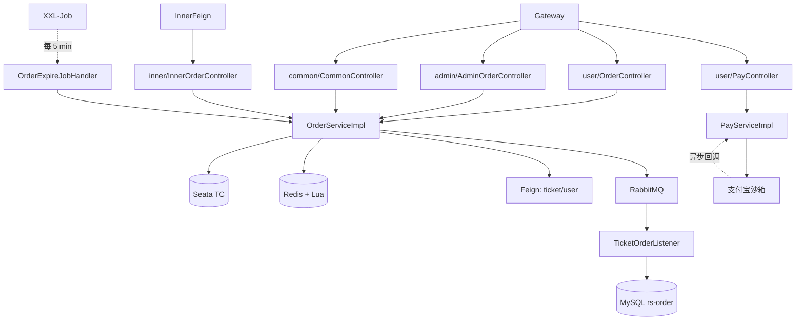
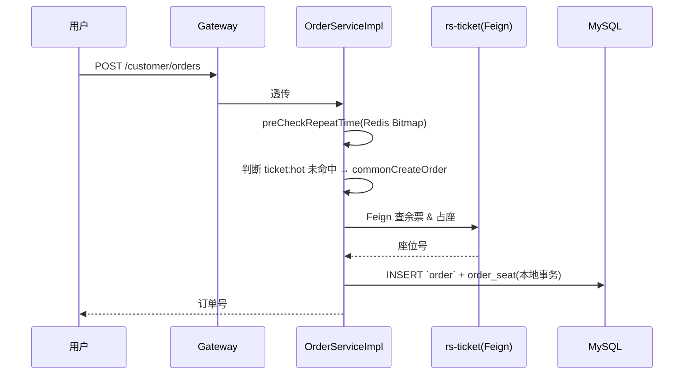
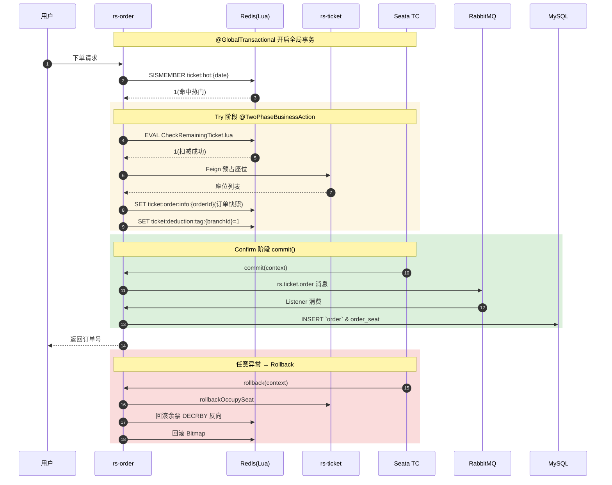
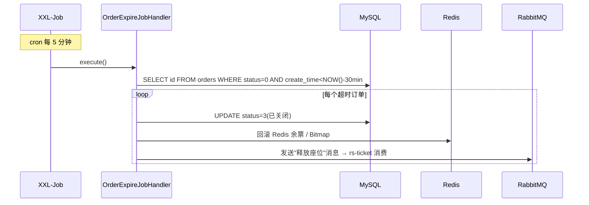

# 订单服务 rs-order

> 整个系统**技术密度最高**的服务。秒杀、TCC 分布式事务、RabbitMQ 异步落库、XXL-Job 超时关单、Redis Bitmap 防时间冲突,全都在这里。

- **服务名**:`order-service`
- **端口**:`18083`
- **源码路径**:[`RailwaySystem-Backend/rs-service/rs-order`](../../RailwaySystem-Backend/rs-service/rs-order)

## 1. 服务职责与边界

| 对外能力 | 说明 |
|---------|------|
| 创建订单 | 普通下单 + 热门秒杀两条分支 |
| 支付 | 接入支付宝沙箱,支持回调更新状态 |
| 退票 | 部分退、全退、自动退差价 |
| 订单查询 | 用户端查自己的、管理端查全量 |
| 超时关单 | XXL-Job 每 5 分钟扫一次,关闭未支付订单 |
| 订单流转 | 待支付 → 已支付 → 已完成 / 已退票 / 已关闭 |

**边界**:

- 只管订单,不管票、不管用户——跨服务走 Feign
- 热门车票走 **Seata TCC**,非热门走**本地事务**
- 发送"订单创建"消息到 RabbitMQ,由自己的消费者异步落库(解耦主流程响应)

## 2. 架构图



## 3. 核心业务流程

### 普通下单(直写数据库)



### 热门秒杀(Redis + Lua + TCC + MQ)

这是**全项目最值得读的一段**。



### 超时关单(XXL-Job)



## 4. 核心代码解说

**TCC 主入口**:

```97:112:RailwaySystem-Backend/rs-service/rs-order/src/main/java/com/rs/service/impl/OrderServiceImpl.java
    @TwoPhaseBusinessAction(name = "createOrder", commitMethod = "commit", rollbackMethod = "rollback")
    @Override
    public OrderCreateResDTO createOrder(BusinessActionContext context, OrderCreateReqDTO reqDTO) {
        // 预检查时间冲突车票
        preCheckRepeatTime(reqDTO);
        String hotKey = TICKET_HOT + LocalDate.now().format(DateTimeFormatter.ofPattern("yyyy:MM:dd"));
        Boolean isHotTicket = stringRedisTemplate.opsForSet().isMember(hotKey, String.valueOf(reqDTO.getTicketId()));
        if (Boolean.TRUE.equals(isHotTicket)) {
            return seckillTicket(context, reqDTO);
        } else {
            OrderService proxy = (OrderService) AopContext.currentProxy();
            return proxy.commonCreateOrder(reqDTO);
        }
    }
```

- `@TwoPhaseBusinessAction` 声明这是一个 TCC 分支事务
- 根据 Redis 判断热门,走不同分支
- `AopContext.currentProxy()` 是必须的——直接 `this.commonCreateOrder` 会绕过 Seata 代理

**Lua 原子扣减**:

```lua
-- CheckRemainingTicket.lua
local key = KEYS[1]
local needCount = tonumber(ARGV[1])
local currentStock = tonumber(redis.call('GET', key))
if currentStock == nil or currentStock < needCount then
    return 0
end
redis.call('DECRBY', key, needCount)
return 1
```

**Rollback 的幂等标记**:

```171:174:RailwaySystem-Backend/rs-service/rs-order/src/main/java/com/rs/service/impl/OrderServiceImpl.java
            String tag = stringRedisTemplate.opsForValue().get(TICKET_DEDUCTION_TAG + context.getBranchId());
            if (tag != null && tag.equals("1")) {
                rollbackRemainingTicket(reqDTO);
            }
```

- `TICKET_DEDUCTION_TAG:{branchId}` 用分支事务 ID 做 key,保证同一分支多次 rollback 不重复扣减
- Seata 在网络抖动时可能重复触发 rollback,这个标记是必须的

## 5. 技术难点 & 踩坑记录

**坑 1:为什么 TCC 而不是 AT?**

AT 模式会在全局事务期间给 `orders` 和 `seat` 表加全局行锁,秒杀场景下会退化成串行。TCC 把"扣减"做到 Redis,主流程完全无锁,吞吐提升 10x+。详细对比见 [技术选型.md](../00-项目概述/技术选型.md)。

**坑 2:Commit 失败了怎么办?**

Commit 发 MQ 如果失败,Seata 会记录到 `undo_log`,事务表中分支事务状态为 `Commit Retrying`。Seata 会按配置重试(默认 15 秒一次),直到成功或达到最大次数。**代价是 MQ 消息消费者必须幂等**——这就是为什么 Listener 里要用 `INSERT ... ON DUPLICATE KEY` 或先查再写。

**坑 3:同一用户防重复下单**

用 Redis 分布式锁 `@Lock` 注解(项目自定义),锁 key = `order:lock:{userId}:{ticketId}:{date}`,TTL 5 秒。轻量、够用。

**坑 4:时间冲突检测 Bitmap 溢出问题**

跨日车次(比如 23:00 出发 → 次日 07:00 到达)要跨两天 Bitmap。我们写了 [`CheckAndSetRepeatTimeCrossDay.lua`](../../RailwaySystem-Backend/rs-service/rs-order/src/main/resources/lua/CheckAndSetRepeatTimeCrossDay.lua) 处理:先查第一天的尾巴,再查第二天的开头,两边都无冲突才允许下单,并原子置位。

**坑 5:热门标记的"热度降温"**

如果一张票曾经是热门,后来冷了,Redis 里的 `hot` Set 还是有它,导致继续走 TCC 路径。解决方案是 XXL-Job 每日重建 Set(旧 key 留 7 天自然过期,新 key 只记当日热门)。

## 📚 相关文档

- [数据库设计](数据库设计.md)
- [专题 01:秒杀一致性深度解析](../07-亮点技术专题/01-秒杀一致性.md) ⭐
- [车票服务](../02-车票服务/README.md)
