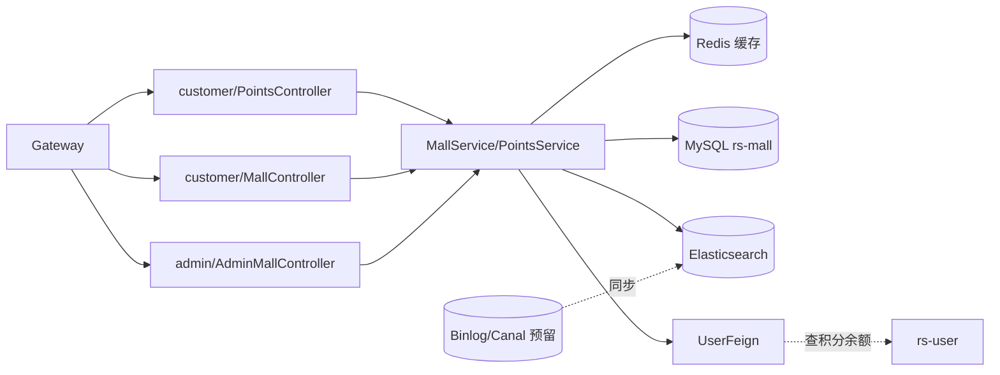
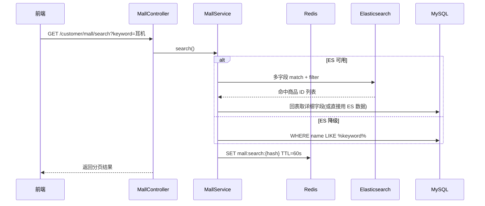
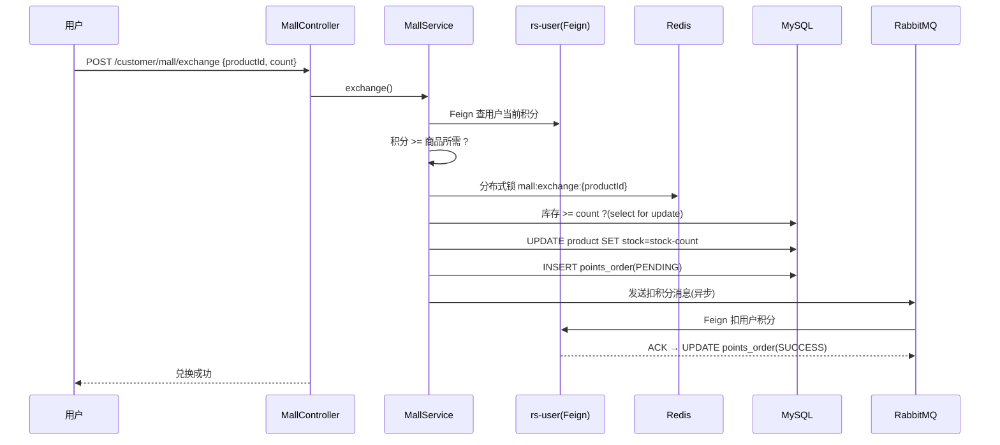

# 积分商城 rs-mall

> 用户用下单累积的积分兑换商品的小型电商子系统。用最少代码串起 MySQL + Elasticsearch + Redis,适合学习**读多写少场景的架构思路**。

- **服务名**:`mall-service`
- **端口**:`18086`
- **源码路径**:[`RailwaySystem-Backend/rs-service/rs-mall`](../../RailwaySystem-Backend/rs-service/rs-mall)

## 1. 服务职责与边界

| 对外能力 | 说明 |
|---------|------|
| 商品浏览 | 分页、分类、关键词搜索 |
| 商品详情 | 单品信息 + 库存 |
| 积分兑换 | 扣积分 + 扣库存 + 生成兑换单 |
| 积分记录 | 用户积分变动流水 |
| 管理端 | 商品上下架、库存管理 |

**边界**:

- 不管用户账户(查积分余额通过 Feign 调 `rs-user`)
- 不管订单业务(兑换单独立于购票订单)

## 2. 架构图



## 3. 核心业务流程

### 商品搜索



### 积分兑换



## 4. 核心代码解说

**ES 索引结构**:

```json
{
  "mappings": {
    "properties": {
      "id": { "type": "keyword" },
      "name": { "type": "text", "analyzer": "ik_max_word" },
      "category": { "type": "keyword" },
      "price": { "type": "long" },
      "points": { "type": "long" },
      "stock": { "type": "integer" },
      "description": { "type": "text", "analyzer": "ik_smart" },
      "onSale": { "type": "boolean" }
    }
  }
}
```

- `ik_max_word` 做商品名切词,匹配"蓝牙耳机"时能同时命中"蓝牙"、"耳机"
- `ik_smart` 做描述切词,降低索引大小
- `onSale` 用 `filter` 过滤,不计算评分

**双写一致性**:

商品 CRUD 时,**先写 MySQL,再写 ES**。如果 ES 写失败,记录到重试表,由定时任务补偿。更完整的方案是引入 Canal 订阅 MySQL Binlog,本项目预留了 `rs-canal` 模块但未启用。

## 5. 技术难点 & 踩坑记录

**坑 1:ES 降级**

如果 ES 未启动,搜索会抛 `NoNodeAvailableException`。我们用 `@ConditionalOnProperty` 控制 ES 客户端是否装配,未装配时 fallback 到 MySQL 查询,**保证商城 80% 功能仍可用**。

**坑 2:积分扣减的原子性**

积分余额在 `rs-user`,商品库存在 `rs-mall`,理论上应该 TCC。但考虑兑换场景容错性高(失败退积分即可),这里走"本地事务 + 异步扣积分 + 失败补偿"的最终一致。如果出现异常,由消息的 DLQ(死信队列)触发人工介入。

**坑 3:Redis 缓存雪崩**

热门商品详情缓存集中过期会雪崩。我们给每个 key 的 TTL 加 ±60 秒随机抖动:

```java
redisTemplate.opsForValue().set(key, value, 300 + random.nextInt(120), TimeUnit.SECONDS);
```

**坑 4:为什么兑换单独立于购票订单?**

- 业务维度完全不同:购票订单有车次、乘车人、支付;兑换单只有商品、数量、收货地址
- 强行合并会让 `orders` 表字段膨胀,索引变脏
- 独立后商城模块可单独裁剪(比如私有部署时不要商城就整个剔除)

## 📚 相关文档

- [数据库设计](数据库设计.md)
