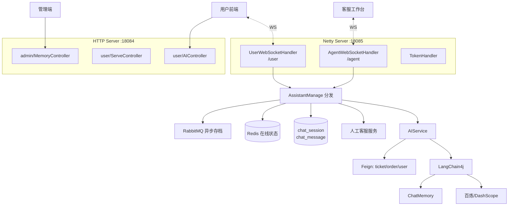
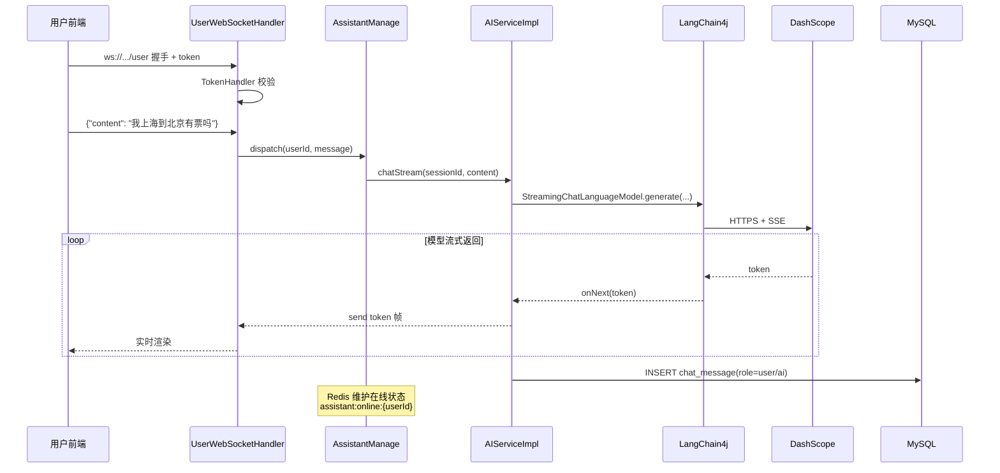
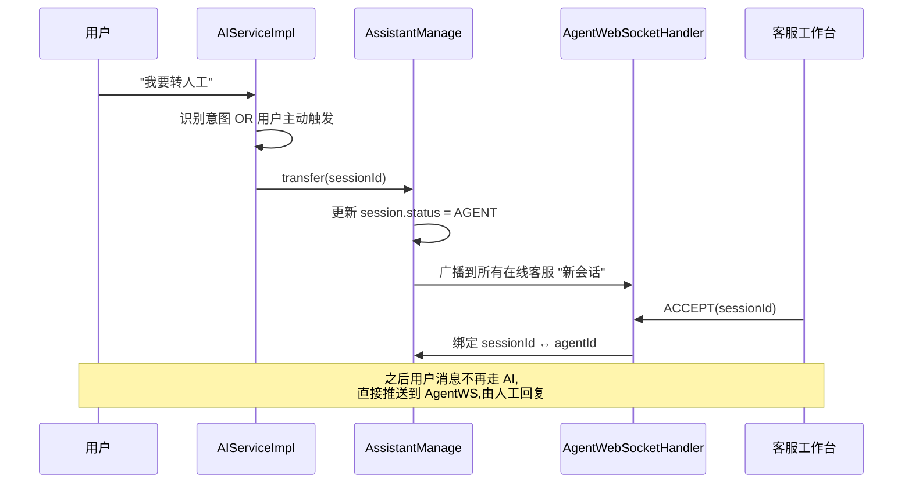

# 客服助手 rs-assistant

> AI 客服 + 人工客服转接系统。基于 **LangChain4j + Netty WebSocket**,支持会话记忆、工具调用、流式输出,是本项目的"AI 时代实战样板"。

- **服务名**:`assistant-service`
- **HTTP 端口**:`18084`
- **WebSocket 端口**:`18085`
- **源码路径**:[`RailwaySystem-Backend/rs-service/rs-assistant`](../../RailwaySystem-Backend/rs-service/rs-assistant)

## 1. 服务职责与边界

| 对外能力 | 说明 |
|---------|------|
| AI 问答 | LangChain4j 接百炼/DashScope,可切换模型 |
| 会话记忆 | 对话历史持久化(MySQL)+ 短期记忆(Redis) |
| WebSocket | 用户端 / 客服端双入口,支持双向推送 |
| 人工转接 | AI 判断不了 → 转人工,客服工作台接单 |
| 管理端 | 查看所有会话、介入对话、记忆导出 |

**边界**:

- 不直接操作业务数据,所有查询(查订单、查票)通过 Feign 调其它服务
- AI 和人工是**同一条 WebSocket 通道**,由 Handler 内部状态决定转给谁

## 2. 架构图



## 3. 核心业务流程

### 用户与 AI 对话(流式)



### AI 转人工



## 4. 核心代码解说

**Netty 启动装配**(`NettyConfig`):

项目自定义 `rs-util/rs-netty` starter,业务服务只需提供 Handler 即可。`AssistantApplication` 启动时 `ApplicationRunner` 触发 Netty ServerBootstrap 绑定 18085 端口,Pipeline 顺序:

```
HttpServerCodec → HttpObjectAggregator → WebSocketServerProtocolHandler → TokenHandler → 业务 Handler
```

**会话记忆**(LangChain4j ChatMemory):

```java
// RailwayAgentConfig.java 要点
ChatMemoryProvider memoryProvider = sessionId ->
    MessageWindowChatMemory.builder()
        .id(sessionId)
        .maxMessages(20)                           // 最近 20 条
        .chatMemoryStore(mysqlChatMemoryStore)     // 自定义落 MySQL
        .build();

Assistant assistant = AiServices.builder(Assistant.class)
    .streamingChatLanguageModel(model)
    .chatMemoryProvider(memoryProvider)
    .tools(new TicketTools(), new OrderTools())   // 工具调用
    .build();
```

- `maxMessages=20` 控制 Token 消耗
- 工具调用让 AI 能主动查订单/车票,而不是瞎答

**用户端 vs 客服端**:

- `UserWebSocketHandler`:绑定 `userId`,消息默认发给 AI
- `AgentWebSocketHandler`:绑定 `agentId`,负责接待多个被转接的会话
- `AssistantManage` 维护两张表:`userId → Channel` 和 `agentId → List<sessionId>`

## 5. 技术难点 & 踩坑记录

**坑 1:流式响应的背压**

模型每秒输出 20-30 token,直接写 WebSocket 可能导致客户端来不及消费。解决:Netty 里利用 `Channel.isWritable()` 判断,不可写时跳过 flush,由 Netty 自动缓冲。

**坑 2:WebSocket 鉴权放哪?**

初版放在业务 Handler 里,导致每条消息都要校验 Token(性能差)。改进:在握手阶段的 `TokenHandler` 做一次性校验,校验通过后将 `userId` 存入 `ChannelAttribute`,业务层直接读。

**坑 3:会话超时**

长时间不活跃的 WebSocket 连接要主动关闭,否则会耗尽连接资源。Pipeline 加 `IdleStateHandler(120, 0, 0)`——120 秒无读触发心跳,再不应答就断开。

**坑 4:LangChain4j 的 Tools 怎么绑业务数据?**

Tools 方法要在 Spring Bean 里,用 `@Tool` 注解,参数必须简单类型或 `@P` 包装的字符串。复杂对象要自己反序列化。示例:

```java
@Tool("查询用户在指定日期的订单")
String queryOrder(@P("用户ID") Long userId, @P("日期 yyyy-MM-dd") String date) {
    return JSONUtil.toJsonStr(orderClient.listByUserAndDate(userId, date));
}
```

**坑 5:模型 API Key 泄露**

Key 绝对不能进 Git。本项目放在 Nacos `shared-langchain4j.yaml`,通过 namespace 隔离 dev/prod,代码里只用占位符。**审查这个项目 PR 时重点看有没有人不小心把 Key 硬编码。**

## 📚 相关文档

- [数据库设计](数据库设计.md)
- [专题 03:LangChain4j + Netty 搭建 AI 客服](../07-亮点技术专题/03-AI客服实现.md) ⭐
